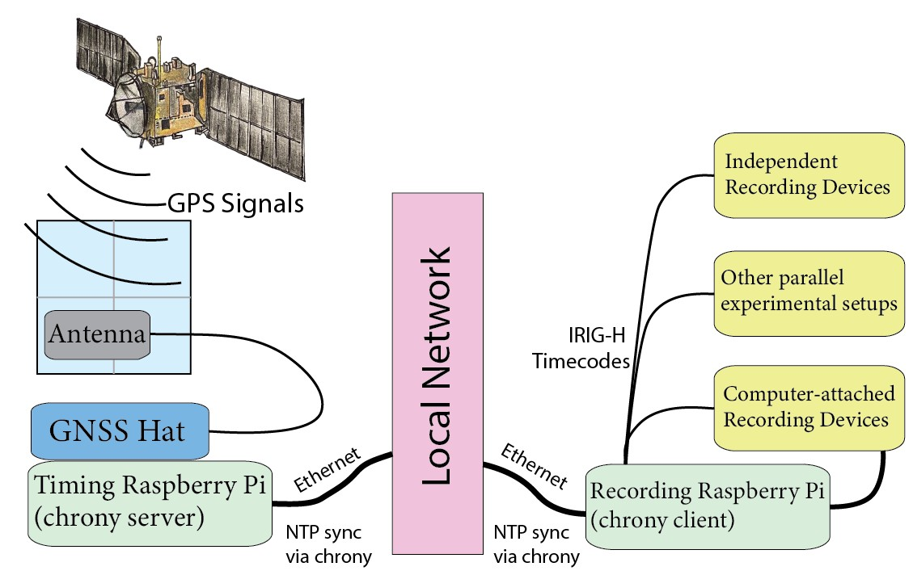

# NeuroKairos: GPS-based synchronization for neuroscience experiments

A universal, open-source timing synchronization solution for neuroscience experiments. NeuroKairos continuously obtains the earth's Coordinated Universal Time (UTC) from the atomic clocks inside GPS satellites and encodes it a sequence of TTL pulses known as an IRIG-H timecode. Any instrument that can record this timecode through TTL pulses or a blinking LED can therefore continuously timestamp its simultaneously-recorded data with objective UTC time. This enables virtually any device to synchronize to UTC time, which provides a common reference for aligning different data streams with each other.



*NeuroKairos system architecture: a GPS-disciplined Raspberry Pi serves as both a stratum-1 NTP server for network-connected devices and an IRIG-H timecode generator for direct hardware timing signals.*

## The Problem

Modern neuroscience experiments require precise synchronization of multiple data streams — electrophysiology, cameras, behavioral apparatus — but each device runs on its own internal clock. These clocks drift apart during experiments, and timing errors as small as one millisecond can reduce neural decoding accuracy from perfect performance to random chance. No universal solution exists: laboratories are forced to build unreliable custom systems or purchase expensive commercial timing hardware with restrictive compatibility requirements.

## The Solution

NeuroKairos combines two mature technologies — GPS atomic clock disciplining and IRIG timecodes — to create a universal synchronization system on consumer hardware. The system works with **any recording device** capable of sampling voltage pulses or imaging LEDs, requiring no modifications to existing equipment.

**Dual-mode timing distribution:**
1. **Network Time Protocol (NTP)**: The GPS-disciplined Raspberry Pi serves as a stratum-1 NTP server for all network-connected devices
2. **IRIG-H hardware signals**: GPIO pins output pulse-width modulated timecodes that can be recorded directly alongside experimental data

Validation against 30,000 Hz electrophysiology demonstrated an average timing accuracy of **33 microseconds** with 99.44% of events at sub-sample precision and zero decoding errors over 25 hours of continuous recording.

## What is IRIG-H?

IRIG-H is one of the simplest formats in the IRIG timecode family (IRIG Standard 200), transmitting one pulse per second with 60 pulses per frame. Each pulse encodes a binary value through its width: 0.2s for binary 0, 0.5s for binary 1, and 0.8s for position markers. Frames encode minutes, hours, day of year, and year in Binary Coded Decimal (BCD) format.

For detailed specifications including the complete bit map and encoding tables, see the [IRIG-H Standard Reference](docs/irig-h-standard.md).

## Hardware Requirements

- **Raspberry Pi 4 Model B**
- **Waveshare NEO-M8T GNSS Timing Hat** or compatible GPS timing receiver with PPS output
- **GPS antenna** with direct sky visibility
- **GPIO connections**: Default BCM GPIO 11 for IRIG output (configurable via `-p`/`-n` flags)

## Installation

### Python Decoder Library

The `neurokairos` Python package decodes IRIG-H timecodes from recorded data. It runs on any machine — no Raspberry Pi required.

```bash
pip install .

# Or for development (editable install with test dependencies)
pip install -e ".[test]"
```

### Raspberry Pi Setup

The following steps run on the Raspberry Pi that will generate IRIG-H signals.

#### 1. Configure GPS Clock Disciplining

```bash
# Install chrony + gpsd with GPS PPS disciplining (stratum 1 server)
sudo ./raspberry_pi/scripts/install_chrony_server.sh

# Or install as NTP client only (no GPS)
sudo ./raspberry_pi/scripts/install_chrony_client.sh --server <your-ntp-server>
```

#### 2. Compile C Sender

```bash
cd raspberry_pi/sender
make
```

#### 3. Install as System Service

```bash
# Install with default pins (BCM GPIO 11, inverted disabled)
./raspberry_pi/scripts/install.sh

# Install with custom pins
./raspberry_pi/scripts/install.sh -p 17 -n 27

# Install with custom LED warning threshold (ms)
./raspberry_pi/scripts/install.sh -p 17 -w 2.0
```

The install script compiles the sender, copies it to `/usr/local/bin/`, generates the systemd service file with your pin configuration baked in, and starts the service. To change pins later, just re-run `install.sh` with the new flags — it will restart the service automatically.

The service runs with Nice -20 priority and SCHED_FIFO real-time scheduling for low-latency timing.

## Usage

### Generation (Raspberry Pi)

1. **Clock synchronization**: System clock is synchronized to GPS via chrony
2. **Continuous generation**: `irig_sender` runs as a systemd service, generating IRIG-H frames
3. **Signal output**: GPIO pin(s) output pulse-width modulated signals encoding UTC time
4. **Data recording**: Recording equipment samples GPIO signals alongside experimental data

### Decoding (Python)

```python
import neurokairos

# Decode from a SpikeGLX recording
clock_table = neurokairos.decode_sglx_irig("recording.bin")

# Decode from an interleaved int16 .dat file
clock_table = neurokairos.decode_dat_irig("recording.dat", sample_rate=30000)

# Decode from video with IRIG LED
clock_table = neurokairos.decode_video_irig("recording.mp4", roi=(x, y, w, h))

# Decode from pre-extracted pulse intervals
clock_table = neurokairos.decode_intervals_irig(intervals, start_time)

# Convert sample indices to UTC timestamps
utc_times = clock_table.source_to_reference(sample_indices)
```

The returned `ClockTable` provides bidirectional interpolation between source samples and UTC time, with save/load to NPZ and JSON-serializable metadata.

## Python Package

### Modules

| Module | Description |
|--------|-------------|
| `irig.py` | IRIG-H decoder pipeline: pulse classification, BCD encode/decode, frame decoding, `build_clock_table` orchestrator |
| `clock_table.py` | `ClockTable` dataclass: sparse time mapping with bidirectional interpolation, NPZ save/load |
| `ttl.py` | Signal processing: `auto_threshold` (Otsu's method), `detect_edges`, `measure_pulse_widths` |
| `sglx.py` | SpikeGLX `.meta` reader + `decode_sglx_irig` entry point |
| `video.py` | Video LED extraction + `decode_video_irig` entry point (requires OpenCV) |

### Public API

- `ClockTable` — sparse time mapping (source <-> reference)
- `bcd_encode`, `bcd_decode` — BCD encoding/decoding
- `decode_dat_irig` — decode from interleaved int16 `.dat` files
- `decode_sglx_irig` — decode from SpikeGLX `.bin` + `.meta`
- `decode_video_irig` — decode from video files with IRIG LED
- `decode_intervals_irig` — decode from pre-extracted pulse intervals

## Performance

Validated against 30,000 Hz electrophysiology recording over 25 hours:

| Metric | Value |
|--------|-------|
| Average timing delay (IRIG vs PPS) | 33 microseconds |
| Events at primary peak (33 us) | 99.44% |
| Events at secondary peak (67 us) | 0.56% |
| Rare excursions (0.7-4 ms) | 0.005% |
| Pulse duration standard deviation | < 1 ms |
| Decoding errors | 0 |

## System Service Management

```bash
# Check status
sudo systemctl status irig-sender.service

# View logs
sudo journalctl -u irig-sender.service -f

# Stop/start
sudo systemctl stop irig-sender.service
sudo systemctl start irig-sender.service

# Uninstall
./raspberry_pi/scripts/uninstall.sh
```

## File Structure

```
neurokairos/
├── raspberry_pi/                        # Raspberry Pi (generation)
│   ├── sender/
│   │   ├── irig_sender.c               # C sender with direct GPIO access
│   │   └── Makefile
│   ├── systemd/
│   │   └── irig-sender.service          # systemd service template
│   ├── scripts/
│   │   ├── install.sh                   # Install sender as systemd service
│   │   ├── uninstall.sh                 # Remove sender service
│   │   ├── install_chrony_server.sh     # GPS + chrony setup (stratum 1)
│   │   ├── install_chrony_client.sh     # chrony NTP client setup
│   │   └── test_chrony.sh              # chrony/gpsd diagnostics
│   └── docs/
│       └── timing-loop.md              # C sender timing loop documentation
├── neurokairos/                         # Python package (decoding)
│   ├── __init__.py
│   ├── irig.py
│   ├── clock_table.py
│   ├── ttl.py
│   ├── sglx.py
│   └── video.py
├── tests/
├── docs/
│   ├── irig-h-standard.md
│   ├── system_architecture.jpg
│   └── irig_h_frame_structure.jpg
├── pyproject.toml
├── README.md
├── CLAUDE.md
└── LICENSE
```

## Citation

If you use NeuroKairos in your research, please cite:

> Kerr, C. (2025). NeuroKairos: A Universal GPS Satellite-Based Solution to Synchronization in Neuroscience Experiments.

## References

- Range Commanders Council, Telecommunications and Timing Group. (2016). *IRIG Serial Time Code Formats*. RCC Standard 200-16. White Sands Missile Range, New Mexico.
- [IRIG timecode (Wikipedia)](https://en.wikipedia.org/wiki/IRIG_timecode)
- [Chrony documentation](https://chrony.tuxfamily.org/)
- [NIST Time and Frequency Division](https://www.nist.gov/pml/time-and-frequency-division/)

## License

MIT License. See [LICENSE](LICENSE) for details.
