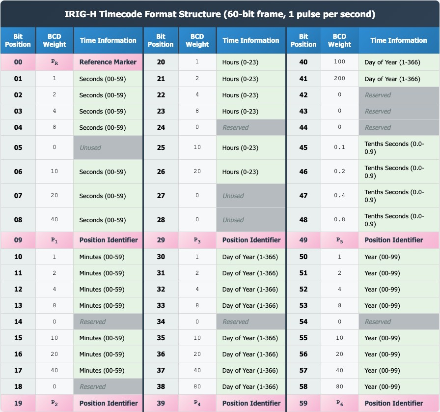

# IRIG-H Timecode Standard Reference

## IRIG Timecode Family

IRIG timecodes are a family of standardized timing formats from the Inter-Range Instrumentation Group (IRIG), originally developed in the 1950s for military missile testing and aerospace telemetry (defined in IRIG Standard 200). The formats differ in bit rate, frame rate, and carrier frequency:

| Format | Frame Rate | Bit Rate | Carrier Frequencies |
|--------|-----------|----------|-------------------|
| A | 10 frames/sec | 1,000 bits/sec | 10 kHz, 100 kHz, 1 MHz |
| B | 1 frame/sec | 100 bits/sec | 1 kHz, 10 kHz, 100 kHz |
| D | 1 frame/hour | 1 bit/min | 0.001 Hz |
| E | 1 frame/10 sec | 10 bits/sec | 100 Hz, 1 kHz |
| G | 100 frames/sec | 10,000 bits/sec | 100 kHz, 1 MHz |
| **H** | **1 frame/min** | **1 bit/sec** | **1 Hz, 10 Hz, 100 Hz** |

IRIG-B is the most commonly used format, followed by IRIG-A and IRIG-G. IRIG-H derivatives are used by NIST radio stations WWV, WWVH, and WWVB for time broadcast.

## IRIG-H Specifics

IRIG-H transmits 1 bit per second with 60 bits per frame, so each frame takes exactly 1 minute and begins at the start of a minute. This means the **seconds** field (bits 1-8) and **deciseconds** field (bits 45-48) are always 0 — only **minutes, hours, day of year, and year** carry meaningful time information.

IRIG-H's one-pulse-per-second structure makes it suitable for non-real-time operating systems that can handle microsecond jitter without losing accuracy.

## Pulse Width Encoding

Time is encoded in Binary Coded Decimal (BCD) format using pulse-width modulation. Three pulse widths encode different values:

| Pulse Width | Meaning |
|------------|---------|
| 0.2 seconds | Binary 0 |
| 0.5 seconds | Binary 1 |
| 0.8 seconds | Position marker (P) |

All pulses begin at the rising edge, which occurs precisely at the start of each second. The rising edge timing is critical for synchronization; the falling edge differentiates the pulse type.

## Frame Structure

Each 60-bit IRIG-H frame encodes:
- Minutes (bits 10-17)
- Hours (bits 20-26)
- Day of year (bits 30-41)
- Year, 2-digit (bits 50-58)
- Seconds (bits 1-8) — always 0 in IRIG-H
- Deciseconds (bits 45-48) — always 0 in IRIG-H

Position markers (P) at bits 0, 9, 19, 29, 39, 49, and 59 provide frame synchronization.

*Complete 60-bit IRIG-H timecode frame showing bit positions, BCD weights, and time information encoding. Frame markers (P_R) and position identifiers (P1-P6) provide synchronization references. Created based on IRIG Standard 200-16 specifications (Range Commanders Council, 2016).*

### Detailed Bit Map

| Bit Position | BCD Weight | Time Information | Bit Position | BCD Weight | Time Information |
|--------------|-----------|------------------|--------------|-----------|------------------|
| 00 | P | Reference Marker | 30 | 1 | Day of Year (1-366) |
| 01 | 1 | Seconds (00-59) | 31 | 2 | Day of Year |
| 02 | 2 | Seconds | 32 | 4 | Day of Year |
| 03 | 4 | Seconds | 33 | 8 | Day of Year |
| 04 | 8 | Seconds | 34 | 0 | Reserved |
| 05 | 0 | Unused | 35 | 10 | Day of Year |
| 06 | 10 | Seconds | 36 | 20 | Day of Year |
| 07 | 20 | Seconds | 37 | 40 | Day of Year |
| 08 | 40 | Seconds | 38 | 80 | Day of Year |
| 09 | P | Position Identifier | 39 | P | Position Identifier |
| 10 | 1 | Minutes (00-59) | 40 | 100 | Day of Year |
| 11 | 2 | Minutes | 41 | 200 | Day of Year |
| 12 | 4 | Minutes | 42 | 0 | Reserved |
| 13 | 8 | Minutes | 43 | 0 | Reserved |
| 14 | 0 | Reserved | 44 | 0 | Reserved |
| 15 | 10 | Minutes | 45 | 0.1 | Tenths Seconds (0.0-0.9) |
| 16 | 20 | Minutes | 46 | 0.2 | Tenths Seconds |
| 17 | 40 | Minutes | 47 | 0.4 | Tenths Seconds |
| 18 | 0 | Reserved | 48 | 0.8 | Tenths Seconds |
| 19 | P | Position Identifier | 49 | P | Position Identifier |
| 20 | 1 | Hours (0-23) | 50 | 1 | Year (00-99) |
| 21 | 2 | Hours | 51 | 2 | Year |
| 22 | 4 | Hours | 52 | 4 | Year |
| 23 | 8 | Hours | 53 | 8 | Year |
| 24 | 0 | Reserved | 54 | 0 | Reserved |
| 25 | 10 | Hours | 55 | 10 | Year |
| 26 | 20 | Hours | 56 | 20 | Year |
| 27 | 0 | Unused | 57 | 40 | Year |
| 28 | 0 | Unused | 58 | 80 | Year |
| 29 | P | Position Identifier | 59 | P | Position Identifier |

## BCD Encoding Scheme

Binary Coded Decimal uses weighted bit positions to encode decimal digits:

**Example**: 45 minutes
- Ones place: 5 = 1 + 4 → bits with weights 1 and 4 are HIGH
- Tens place: 4 = 4 → bit with weight 40 is HIGH
- Result: Bits 10, 12, and 17 are HIGH in the minutes field

## Pulse Classification (Decoding)

During decoding, pulse widths are classified by thresholds relative to the 1-second bit period:
- **Short pulse** (< 0.35 × bit_length): Binary 0
- **Medium pulse** (0.35-0.65 × bit_length): Binary 1
- **Long pulse** (> 0.65 × bit_length): Position marker P

## References

- Range Commanders Council, Telecommunications and Timing Group. (2016). *IRIG Serial Time Code Formats*. RCC Standard 200-16. White Sands Missile Range, New Mexico.
- [IRIG timecode (Wikipedia)](https://en.wikipedia.org/wiki/IRIG_timecode)
