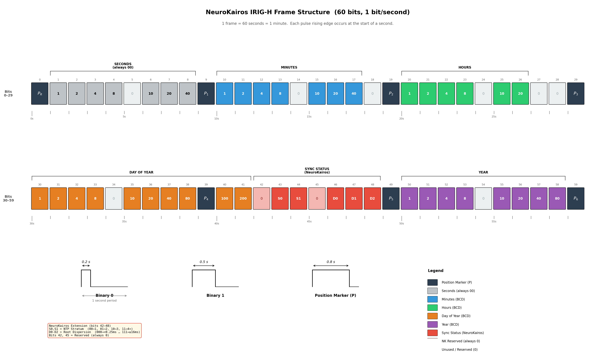

# IRIG-H Timecode Standard Reference

## IRIG Timecode Family

IRIG timecodes are a family of standardized timing formats from the Inter-Range Instrumentation Group (IRIG), originally developed in the 1950s for military missile testing and aerospace telemetry (defined in IRIG Standard 200). The formats differ in bit rate, frame rate, and carrier frequency:

| Format | Frame Rate | Bit Rate | Carrier Frequencies |
|--------|-----------|----------|-------------------|
| A | 10 frames/sec | 1,000 bits/sec | 10 kHz, 100 kHz, 1 MHz |
| B | 1 frame/sec | 100 bits/sec | 1 kHz, 10 kHz, 100 kHz |
| D | 1 frame/hour | 1 bit/min | 0.001 Hz |
| E | 1 frame/10 sec | 10 bits/sec | 100 Hz, 1 kHz |
| G | 100 frames/sec | 10,000 bits/sec | 100 kHz, 1 MHz |
| **H** | **1 frame/min** | **1 bit/sec** | **1 Hz, 10 Hz, 100 Hz** |

IRIG-B is the most commonly used format, followed by IRIG-A and IRIG-G. IRIG-H derivatives are used by NIST radio stations WWV, WWVH, and WWVB for time broadcast.

## IRIG-H Specifics

IRIG-H transmits 1 bit per second with 60 bits per frame, so each frame takes exactly 1 minute and begins at the start of a minute. This means the **seconds** field (bits 1-8) and **deciseconds** field (bits 45-48) are always 0 — only **minutes, hours, day of year, and year** carry meaningful time information.

IRIG-H's one-pulse-per-second structure makes it suitable for non-real-time operating systems that can handle microsecond jitter without losing accuracy.

## Pulse Width Encoding

Time is encoded in Binary Coded Decimal (BCD) format using pulse-width modulation. Three pulse widths encode different values:

| Pulse Width | Meaning |
|------------|---------|
| 0.2 seconds | Binary 0 |
| 0.5 seconds | Binary 1 |
| 0.8 seconds | Position marker (P) |

All pulses begin at the rising edge, which occurs precisely at the start of each second. The rising edge timing is critical for synchronization; the falling edge differentiates the pulse type.

## Frame Structure

Each 60-bit IRIG-H frame encodes:
- Minutes (bits 10-17)
- Hours (bits 20-26)
- Day of year (bits 30-41)
- Year, 2-digit (bits 50-58)
- Seconds (bits 1-8) — always 0 in IRIG-H
- Deciseconds (bits 45-48) — always 0 in standard IRIG-H; bits 43-44 and 46-48 are repurposed for sync status in NeuroKairos (see below)

Position markers (P) at bits 0, 9, 19, 29, 39, 49, and 59 provide frame synchronization.

### Detailed Bit Map

*Color-coded 60-bit IRIG-H frame showing BCD weights, field groupings, position markers, and NeuroKairos sync status extensions (bits 42–48). Generated by `docs/generate_irig_h_figure.py`.*

| Bit | Weight | Field | Notes |
|----:|-------:|:------|:------|
| 0 | P | **Reference Marker** | Frame start (P_R) |
| 1 | 1 | Seconds | Always 0 in IRIG-H |
| 2 | 2 | Seconds | |
| 3 | 4 | Seconds | |
| 4 | 8 | Seconds | |
| 5 | — | *Unused* | Always 0 |
| 6 | 10 | Seconds | |
| 7 | 20 | Seconds | |
| 8 | 40 | Seconds | |
| 9 | P | **Position Identifier** | P1 |
| 10 | 1 | Minutes (00–59) | |
| 11 | 2 | Minutes | |
| 12 | 4 | Minutes | |
| 13 | 8 | Minutes | |
| 14 | — | *Reserved* | Always 0 |
| 15 | 10 | Minutes | |
| 16 | 20 | Minutes | |
| 17 | 40 | Minutes | |
| 18 | — | *Reserved* | Always 0 |
| 19 | P | **Position Identifier** | P2 |
| 20 | 1 | Hours (00–23) | |
| 21 | 2 | Hours | |
| 22 | 4 | Hours | |
| 23 | 8 | Hours | |
| 24 | — | *Reserved* | Always 0 |
| 25 | 10 | Hours | |
| 26 | 20 | Hours | |
| 27 | — | *Unused* | Always 0 |
| 28 | — | *Unused* | Always 0 |
| 29 | P | **Position Identifier** | P3 |
| 30 | 1 | Day of Year (001–366) | |
| 31 | 2 | Day of Year | |
| 32 | 4 | Day of Year | |
| 33 | 8 | Day of Year | |
| 34 | — | *Reserved* | Always 0 |
| 35 | 10 | Day of Year | |
| 36 | 20 | Day of Year | |
| 37 | 40 | Day of Year | |
| 38 | 80 | Day of Year | |
| 39 | P | **Position Identifier** | P4 |
| 40 | 100 | Day of Year | |
| 41 | 200 | Day of Year | |
| 42 | — | *Reserved* | Always 0 (NeuroKairos: reserved) |
| 43 | S0 | **NK: Stratum** | NeuroKairos sync status, bit 0 |
| 44 | S1 | **NK: Stratum** | NeuroKairos sync status, bit 1 |
| 45 | — | *Reserved* | Standard: 0.1s (always 0). NeuroKairos: reserved |
| 46 | D0 | **NK: Root Dispersion** | NeuroKairos sync status, bit 0 |
| 47 | D1 | **NK: Root Dispersion** | NeuroKairos sync status, bit 1 |
| 48 | D2 | **NK: Root Dispersion** | NeuroKairos sync status, bit 2 |
| 49 | P | **Position Identifier** | P5 |
| 50 | 1 | Year (00–99) | |
| 51 | 2 | Year | |
| 52 | 4 | Year | |
| 53 | 8 | Year | |
| 54 | — | *Reserved* | Always 0 |
| 55 | 10 | Year | |
| 56 | 20 | Year | |
| 57 | 40 | Year | |
| 58 | 80 | Year | |
| 59 | P | **Position Identifier** | P6 (= next frame's P_R) |

## BCD Encoding Scheme

Binary Coded Decimal uses weighted bit positions to encode decimal digits:

**Example**: 45 minutes
- Ones place: 5 = 1 + 4 → bits with weights 1 and 4 are HIGH
- Tens place: 4 = 4 → bit with weight 40 is HIGH
- Result: Bits 10, 12, and 17 are HIGH in the minutes field

## Pulse Classification (Decoding)

During decoding, pulse widths are classified by thresholds relative to the 1-second bit period:
- **Short pulse** (< 0.35 × bit_length): Binary 0
- **Medium pulse** (0.35-0.65 × bit_length): Binary 1
- **Long pulse** (> 0.65 × bit_length): Position marker P

## NeuroKairos Extensions

NeuroKairos repurposes unused IRIG-H bits to encode chrony NTP synchronization quality. In standard IRIG-H, bits 42-48 are either reserved (42-44) or encode deciseconds (45-48), which are always zero at the 1 bit/sec rate. NeuroKairos uses bits 43-44 and 46-48 to carry sync status while keeping bits 42 and 45 as zero (reserved for future use).

### Stratum (bits 43-44, 2 bits)

| Encoded Value | Stratum |
|---------------|---------|
| 00 | Stratum 1 (local GPS) |
| 01 | Stratum 2 |
| 10 | Stratum 3 |
| 11 | Stratum 4+ or not synchronized |

### Root Dispersion (bits 46-48, 3 bits, doubling scale)

| Encoded Value | Root Dispersion |
|---------------|----------------|
| 000 | < 0.25 ms |
| 001 | < 0.5 ms |
| 010 | < 1 ms |
| 011 | < 2 ms |
| 100 | < 4 ms |
| 101 | < 8 ms |
| 110 | < 16 ms |
| 111 | >= 16 ms (or not synchronized) |

### Backward Compatibility

Recordings made before this extension have all status bits set to zero, which decodes as stratum 1 with root dispersion < 0.25 ms. This is ambiguous with a genuinely excellent GPS-locked clock — there is no way to distinguish "old recording without sync status" from "perfectly synchronized." This ambiguity is accepted and documented; downstream analysis should note the recording date relative to when sync status encoding was deployed.

## References

- Range Commanders Council, Telecommunications and Timing Group. (2016). *IRIG Serial Time Code Formats*. RCC Standard 200-16. White Sands Missile Range, New Mexico.
- [IRIG timecode (Wikipedia)](https://en.wikipedia.org/wiki/IRIG_timecode)
